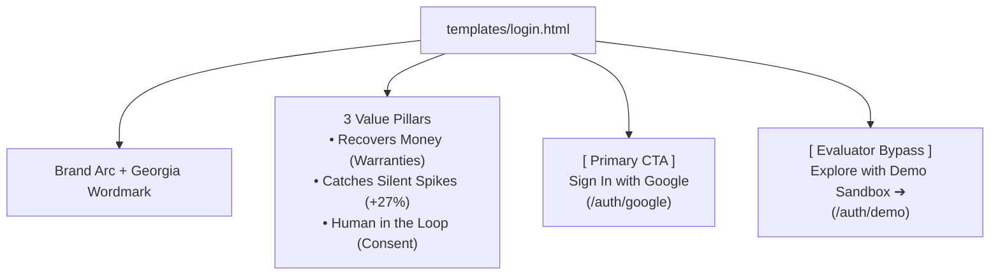

# LOOP — Frontend Architecture & UI Roadmap

This document serves as the complete technical specification and engineering guide for the **frontend developer** building and refining **LOOP** (Autonomous Life-Admin Agent). It covers the **design system**, the **current as-built UI architecture**, **state management & API integration**, and the **step-by-step frontend roadmap**.

---

## 1. Design System & Visual Identity (`LOOP-UI-Design-Rules.pdf`)

LOOP uses a bespoke **editorial paper-toned aesthetic** designed to evoke calm, trust, and precision. It deliberately avoids generic SaaS dark modes, neon gradients, and heavy drop shadows.

### A. Color Palette (CSS Variables)
```css
:root {
  /* Paper Surfaces & Backgrounds */
  --bg: #F3F5F1;            /* Warm sage paper canvas */
  --surface: #FFFFFF;       /* Pure white card surface */
  
  /* Typography & Structure */
  --ink: #1B2420;           /* Deep charcoal/green-black for primary text */
  --muted: #5B6B62;         /* Slate sage for secondary explanations */
  --border: #E1E4DC;        /* Neutral boundary rule */
  
  /* Brand Accents */
  --loop-green: #1F5C45;     /* Primary brand green (trust & resolution) */
  --green-hover: #153F30;    /* Darkened green for button hover states */
  --green-tint: #E3EEE7;     /* Soft sage tint for active pills & tags */
  
  /* Semantic Category Accents */
  --amber-money: #B8863B;    /* Amber: Money recovery, warranties, pending quota */
  --rust: #B54A2A;           /* Rust: Money loss, bill anomalies, destructive actions */
}
```

### B. Typography Hierarchy
* **Headers & Brand**: `'Georgia', 'Source Serif 4', serif`
  * Used for the brand wordmark (`LOOP`), hero statements (`LOOP found 0 open loops.`), card titles, and modal headers.
* **Body & Navigation**: `'Inter', system-ui, sans-serif`
  * Used for buttons, summaries, body copy, and navigation tabs.
* **Evidence & Technical Metadata**: `'JetBrains Mono', 'Consolas', monospace`
  * Strictly required for verified citations (e.g., `receipt_sony_wh1000.txt: Purchased Mar 14, 2026`), dates, badges, and model identifiers.

### C. Visual Rules
* **No Heavy Drop Shadows**: Use crisp `1px solid var(--border)` rules and flat paper layering. Subtle `box-shadow: 0 1px 2px rgba(0,0,0,0.03)` is permissible on active surfaces.
* **Brand Arc Motif**: An open, animated circle in Loop Green:
  ```html
  <svg class="brand-arc" viewBox="0 0 24 24">
    <circle cx="12" cy="12" r="9" fill="none" stroke="#1F5C45" stroke-width="2.5" 
            stroke-dasharray="48 10" stroke-linecap="round" />
  </svg>
  ```

---

## 2. Current Frontend Structure (As-Built)

The frontend is structured into two main templates:

```text
templates/
├── login.html     # Sign-In Gate: Google OAuth 2.0 & Evaluator Sandbox Bypass
└── index.html     # Main Application: 2-Pane Shell, Cards, Timeline & HITL Modal
```

---

### A. The Sign-In Gate (`templates/login.html`)
The entry point for unauthenticated visitors. Protects user privacy while providing 1-click access for judges:



---

### B. Main Application Dashboard (`templates/index.html`)

The dashboard follows a persistent **Two-Pane Layout**:

```text
+-----------------------------------------------------------------------------------+
|  LOOP CONSOLE  [SANDBOX EVALUATOR MODE / AUTHENTICATED]      [Simulate] [Run Discovery] |
+------------------+----------------------------------------------------------------+
| [O] LOOP         |  [!] AWS Bedrock Model Notice: Quota Provisioning Pending      |
|                  |                                                                |
| • All        (0) |  Good evening, Alex.                                           |
| • Money      (0) |  LOOP found 0 open loops.                                      |
| • Deadlines  (0) |  Awaiting AWS Bedrock model quota. Local processing disabled.  |
| • Approvals  (0) |                                                                |
| • Activity       |  +----------------------------------------------------------+  |
|                  |  | [Live Model Ingestion Paused]                             |  |
| [G] Connect Mail |  | Document ingestion is waiting on AWS Bedrock quota.       |  |
|                  |  +----------------------------------------------------------+  |
| +--------------+ |                                                                |
| | Alex Mercer  | |  Activity timeline                                             |
| | [Sign out]   | |  • Live  AWS Bedrock probe completed. Local mock disabled.     |
+------------------+----------------------------------------------------------------+
```

#### Key Layout Components in `templates/index.html`:
1. **Top Simulation Bar (`.demo-bar`)**:
   * Displays active session mode badge (`AUTHENTICATED SESSION` vs `SANDBOX EVALUATOR MODE`).
   * Quick-action buttons to drop synthetic test files (`Simulate: Receipt Arrives`, `Simulate: High Bill`, etc.) for live video recordings.
2. **Left Navigation (`.left-nav`)**:
   * Brand mark with reload trigger.
   * Filter tabs (`All`, `Money`, `Deadlines`, `Documents`, `Approvals`, `Activity`) with live count badges.
   * **Google Gmail Integration Card (`#googleNavCard`)**:
     * Logged out: Displays prominent **"Connect Gmail"** button.
     * Logged in: Displays online pulse dot, connected email, and **"Sync Mail"** / **"Disconnect"** links.
   * User footer (`.nav-bottom`): Displays authenticated user name, email, and **"Sign out"** button.
3. **Main Content Pane (`.main-pane`)**:
   * **AWS Bedrock Status Banner (`#modelStatusBanner`)**: Plainly displays cloud model availability. Features amber border during quota holds and Loop Green border when live.
   * **Hero Header (`.hero-header`)**: Personalizes the greeting (`Good evening, [First Name]`), displays the **Hero Number** of open loops, and summary statement.
   * **Cards Container (`#cardsContainer`)**: Renders dynamic `LifeEvent` cards.
   * **Activity Timeline (`#timelineSection`)**: Chronological feed of agent actions.
4. **Approval View Modal (`#approvalModal`)**:
   * The **Human-in-the-Loop** checkpoint.
   * Left section: Monospace verified citations (`#modalEvidence`).
   * Right section: Real editable claim draft (`#modalDraft` with `contenteditable="true"`).
   * Actions: **Reject** (destructive red), **Save edits**, and **Approve claim** (Loop Green).

---

## 3. Frontend State & JavaScript Architecture

All client-side logic in `templates/index.html` operates around a centralized state object `appData`:

```javascript
// Central Client State
let appData = {
  hero_number: 0,
  awaiting_approval_count: 0,
  completed_count: 0,
  potential_recovery_total: 0.0,
  open_loops: [],      // Array of active LifeEvent objects
  completed_loops: [], // Array of resolved LifeEvent objects
  timeline: [],        // Array of TimelineEntry objects
  bedrock_status: {    // Live AWS Bedrock connection details
    ready: false,
    code: "quota_pending",
    title: "AWS Bedrock Model Notice: Quota Provisioning Pending",
    message: "...",
    region: "eu-north-1",
    model_id: "eu.anthropic.claude-sonnet-4-6"
  }
};
```

### Core JavaScript Functions

| Function | Responsibility |
| :--- | :--- |
| `loadDashboard()` | Calls `GET /api/summary`, updates `appData`, and calls `renderDashboard()`. |
| `renderDashboard()` | Renders hero counters, filters cards by category, renders timeline, and updates Bedrock banner. |
| `createCardElement(evt)` | Builds DOM element for a Life Event card, applying category color border and action buttons. |
| `openApprovalModal(id)` | Fetches `GET /api/event/<id>`, populates evidence and editable draft, and opens modal. |
| `approveAction()` | Dispatches `POST /api/approve/<id>` and updates dashboard with resolution. |
| `rejectAction()` | Dispatches `POST /api/reject/<id>` and dismisses card. |
| `saveEdit()` | Dispatches `POST /api/edit/<id>` with modified draft text from `#modalDraft`. |
| `loadGoogleStatus()` | Checks `GET /api/google/status` and toggles Google connect button vs email pill. |
| `syncGoogleMail()` | Dispatches `POST /api/google/sync` and displays sync count feedback. |
| `filterCategory(cat, el)` | Filters card view (`all`, `money`, `deadlines`, `approvals`) and highlights nav item. |

---

## 4. Backend REST API Contract for Frontend

| Action | Endpoint | Method | Payload Sent | Expected Response |
| :--- | :--- | :--- | :--- | :--- |
| **Fetch Dashboard** | `/api/summary` | `GET` | *None* | `{ hero_number, open_loops: [...], timeline: [...], bedrock_status: {...} }` |
| **Get Event Details**| `/api/event/<id>` | `GET` | *None* | Complete `LifeEvent` JSON object |
| **Approve Action** | `/api/approve/<id>`| `POST`| *None* | `{ result: { status: "completed" }, summary: {...} }` |
| **Reject / Dismiss** | `/api/reject/<id>` | `POST`| *None* | `{ result: { status: "dismissed" }, summary: {...} }` |
| **Save Edited Draft**| `/api/edit/<id>` | `POST`| `{ text: "..." }` | `{ result: { status: "edited" }, summary: {...} }` |
| **Run AI Discovery** | `/api/run-discovery`| `POST`| *None* | `{ result: {...}, summary: {...} }` |
| **Google Auth Status**| `/api/google/status`| `GET`| *None* | `{ connected: true/false, user: { email: "..." } }` |
| **Sync Gmail** | `/api/google/sync` | `POST`| *None* | `{ result: { synced_count: X }, summary: {...} }` |
| **Disconnect Google**| `/api/google/disconnect`| `POST`| *None*| `{ success: true }` |
| **Trigger Simulation**| `/api/simulate/<type>`| `POST`| *None* | `{ success: true, summary: {...} }` |

---

## 5. Upcoming Frontend Roadmap & Tasks (For Frontend Developer)

Here are the prioritized frontend engineering milestones to elevate the user interface:

### Task 1: In-App Toast & Alert Notification System (High Priority)
* **Problem**: Currently, operations like draft saves and sync completions use native browser `alert()`, which interrupts user experience.
* **Objective**: Build a sleek, paper-toned toast notification component.
* **Design Specs**:
  * Fixed at bottom-right of viewport (`bottom: 24px; right: 24px;`).
  * Surface: `#FFFFFF` with `1px solid var(--border)` and left accent border (Green for success, Amber for sync notices).
  * Auto-dismisses after 3.5 seconds with fade-out transition.

---

### Task 2: Mobile Responsive Overhaul & Bottom Navigation
* **Problem**: The current layout is optimized for desktop viewports (`1280px`+) with a fixed 230px left navigation.
* **Objective**: Implement media queries for tablets and mobile devices (`@media (max-width: 768px)`):
  * Collapse the left navigation into a **Bottom Tab Bar** (`All`, `Money`, `Deadlines`, `Profile`).
  * Full-width main pane with touch-friendly tap targets (`min-height: 44px`).
  * Modal overlays transition to bottom-sheet drawers on mobile.

---

### Task 3: Direct File Drag-and-Drop Dropzone
* **Objective**: Allow users to drag receipts, bills, and PDFs directly into the dashboard.
* **Implementation**:
  * Add an upload dropzone area above or below the cards container.
  * Drag-and-drop event handlers: highlight with dashed `--loop-green` border on `dragover`.
  * Uploads file via `POST /api/upload-document` (multipart/form-data) directly to `workspace/inbox/`.

---

### Task 4: Interactive Split-View Document Inspector in Approval Modal
* **Objective**: When reviewing a warranty claim or high utility bill, display the original document alongside the draft:
  * **Left Pane**: Document citation viewer (displaying raw Markdown text or embedded receipt image).
  * **Right Pane**: Prepared editable email draft (`#modalDraft`).
  * Allows the user to cross-reference serial numbers and prices without switching screens.

---

### Task 5: Smooth FLIP Animations for Card Transitions
* **Objective**: When an action is approved or dismissed:
  * Animate the approved card turning green with a checkmark.
  * Animate card collapsing and sliding out smoothly (`opacity: 0; transform: translateY(-10px)`).
  * Decrement the **Hero Number** with an animated number roll.

---

## 6. How to Run & Preview the UI Locally

```bash
# 1. Activate environment
source .venv/bin/activate

# 2. Run the server
PORT=5050 python3 app.py
```

* Open browser at: **`http://127.0.0.1:5050`**
* Test the **Sign-In Gate** at `/login` and click **"Explore with Demo Sandbox ➔"** to preview the full dashboard.
