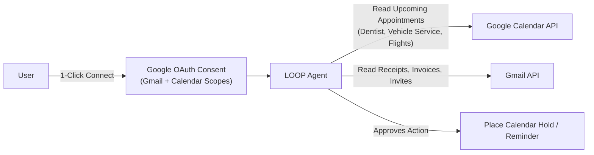

# LOOP — Google Calendar Integration Guide

This guide outlines how **LOOP** connects to Google Calendar alongside Gmail, enabling autonomous appointment ingestion, deadline tracking, and automated calendar holds.

---

## 1. Overview & Architecture

Because LOOP already uses Google OAuth 2.0 for Gmail, **Google Calendar uses the exact same Google Cloud project, Client ID, and Client Secret**.

When a user clicks **"Connect Gmail"**, Google grants access to both services in a single 10-second authorization prompt:



---

## 2. Google Cloud Setup (2 Steps)

### Step 1: Enable the Google Calendar API
1. Open Google Cloud Console:
   👉 **[Google Calendar API Library](https://console.cloud.google.com/apis/library/calendar-json.googleapis.com)**
2. Ensure your project (`LOOP Life Agent`) is selected in the top bar.
3. Click the blue **ENABLE** button.

---

### Step 2: Add Calendar Scopes to OAuth Consent Screen
1. Go to **Google Auth Platform ➔ Data Access** (or *APIs & Services ➔ OAuth consent screen*):
   👉 **[OAuth Consent Screen Scopes](https://console.cloud.google.com/apis/credentials/consent)**
2. Click **ADD OR REMOVE SCOPES**.
3. In the filter box, type `calendar`.
4. Select the following scopes:
   * **`https://www.googleapis.com/auth/calendar.readonly`**
     * *Purpose*: Allows LOOP to inspect upcoming events, dentist exams, flights, and deadlines to prepare reminders or reimbursement forms in advance.
   * **`https://www.googleapis.com/auth/calendar.events`** *(Recommended)*
     * *Purpose*: Allows LOOP to automatically place hold blocks or armed reminder notifications on your calendar when you click **Approve** on the dashboard.
5. Click **UPDATE** at the bottom of the sidebar.
6. Click **SAVE AND CONTINUE**.

---

## 3. How LOOP Uses Calendar Data

### A. Ingestion (Autonomous Preparation)
* **Upcoming Appointments**: Ingests appointments occurring in the next 14–30 days (e.g., *Pacific Dental Group — Oct 15 at 3:00 PM*).
* **Cross-Referencing**:
  * Matches doctor/dentist calendar entries with medical insurance policy reimbursement forms.
  * Pre-fills employee health expense claims so they are ready for user signature *before* the appointment.
* **Deadlines**:
  * Detects subscription trial endings, flight check-in windows, and lease renewal dates.
  * Arms an automated reminder notification 1 day prior.

### B. Execution (Two-Way Action Sync)
* When you review a meeting invitation or RSVP on the LOOP dashboard:
  * Clicking **Approve** not only prepares/sends the confirmation email but also automatically inserts the confirmed event and meeting link directly into your primary Google Calendar.

---

## 4. Technical Reference (Python Implementation)

### Scopes Definition (`tools/gmail_sync.py`)
```python
SCOPES = [
    "https://www.googleapis.com/auth/gmail.readonly",
    "https://www.googleapis.com/auth/userinfo.email",
    "https://www.googleapis.com/auth/calendar.readonly",
    "https://www.googleapis.com/auth/calendar.events"
]
```

### Fetching Calendar Events
```python
from googleapiclient.discovery import build
import datetime

def sync_calendar_events(creds):
    service = build("calendar", "v3", credentials=creds)
    now = datetime.datetime.utcnow().isoformat() + "Z"
    
    events_result = service.events().list(
        calendarId="primary",
        timeMin=now,
        maxResults=20,
        singleEvents=True,
        orderBy="startTime"
    ).execute()
    
    return events_result.get("items", [])
```

### Creating Calendar Holds Upon User Approval
```python
def create_calendar_hold(creds, title, start_iso, end_iso, description=""):
    service = build("calendar", "v3", credentials=creds)
    event = {
        "summary": f"[LOOP Hold] {title}",
        "description": description,
        "start": {"dateTime": start_iso},
        "end": {"dateTime": end_iso},
        "reminders": {
            "useDefault": False,
            "overrides": [
                {"method": "popup", "minutes": 60},
                {"method": "email", "minutes": 1440},
            ],
        },
    }
    created = service.events().insert(calendarId="primary", body=event).execute()
    return created.get("htmlLink")
```

---

## 5. Security & Privacy
* **Local Token Storage**: Tokens are stored locally in `data/google_token.json`.
* **Zero Third-Party Relays**: All calendar and email API requests communicate directly between your server and Google’s official endpoints over HTTPS.
* **Revocable Anytime**: You can disconnect Google directly from the LOOP dashboard or revoke access in your Google Account Security settings.
