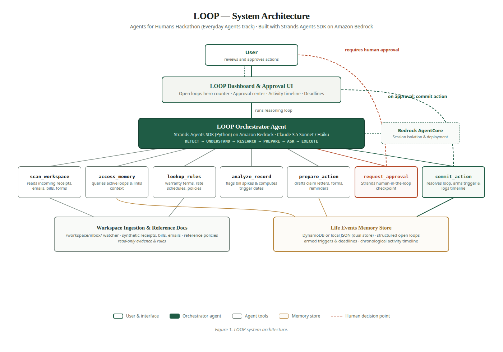

# LOOP — Autonomous Life-Admin Agent

> **Agents for Humans Hackathon** · Everyday Agents Track  
> Built with **Strands Agents SDK** on **Amazon Bedrock**  
> License: **MIT Open Source License**



---

## 1. Executive Summary & The Problem

Every day, people lose hours to administrative life busywork — following up on expired warranties, disputing sudden utility price hikes, deciphering medical reimbursement forms, and setting meeting reminders. 

Existing products (reminders, expense trackers) only manage information: they stop at *"Here's a reminder to file your warranty"* and leave the actual follow-through to the user.

> A 2024 *Public Administration Review* study (Martin, 2,243 UK adults surveyed) found people spend roughly **32 to 85 minutes a day** on administrative tasks across ten life domains — bills, health, benefits, debt, and more.

**LOOP closes the loop.** It discovers unfinished business hiding in a person's everyday information — receipts, bills, complaint emails, calendar invites, and forms — and turns it into completed actions, not another reminder.

### Core Philosophy
**"Autonomous by default, human when it matters."**
* **Low-risk actions run automatically**: Scanning documents, correlating evidence, querying warranty policies, calculating bill variances, preparing drafts.
* **High-impact actions pause for human approval**: Submitting warranty replacement claims, disputing billing charges, confirming appointments.

---

## 2. The 6-Stage Reasoning Loop

```
DETECT ───► UNDERSTAND ───► RESEARCH ───► PREPARE ───► ASK ───► EXECUTE
  │              │              │            │          │          │
Scan raw       Create/Link    Check rules  Draft claim/ Pauses for   Marks done
receipts/      Life Event     & policies   evidence     human ok     in store &
emails/bills   records        (local ref)  package      (HITL)       logs timeline
```

---

## 3. System Architecture & Tech Stack

* **Orchestrator Agent**: Strands Agents SDK (Python) on Amazon Bedrock (`Claude 3.5 Sonnet` / `Claude 3 Haiku` in `us-east-1`).
* **Memory & Storage**: **Dual-Store Architecture**
  * `LocalJsonStore`: Zero-dependency file persistence for immediate local execution and offline presentations.
  * `DynamoDBStore`: `boto3`-backed implementation for scalable AWS Cloud deployments.
* **Deployment**: Amazon Bedrock AgentCore Runtime (`@aws/agentcore` / session isolation).
* **UI**: Light, paper-toned personal filing ledger (`#F3F5F1`, serif typography, monospace evidence citations, animated closing arc brand mark) adhering to `LOOP-UI-Design-Rules.pdf`.

---

## 4. The 7 Generalized Agent Tools

1. **`scan_workspace`**: Ingests new receipts, bills, complaint emails, calendar invites, and forms.
2. **`access_memory`**: Solves agent amnesia by querying active open loops and connecting new clues to past records.
3. **`lookup_rules`**: Retrieves reference warranty terms, return windows, and utility dispute rules.
4. **`analyze_record`**: Deterministic math engine (calculates bill percentage spikes and exact reminder triggers like `event_date - 1 day`).
5. **`prepare_action`**: Drafts full, formal claim letters, dispute inquiries, pre-filled forms, or reminder notices.
6. **`request_approval`**: Strands Human-in-the-Loop checkpoint pausing execution before high-impact operations.
7. **`commit_action`**: Commits approved actions, marks open loops resolved, and appends conversational timeline logs.

---

## 5. Working Use Cases Demonstrated

| Use Case | Category | Flow Demonstrated | Value Delivered |
| :--- | :--- | :--- | :--- |
| **Warranty Recovery** *(Flagship)* | Money to Recover | Links purchase receipt to complaint email ➔ verifies 1-yr Sony policy ➔ drafts formal claim letter ➔ pauses for approval ➔ executes | **$179.00** potential recovery |
| **Electricity Bill Anomaly** | Money to Lose | Ingests 5 months history ➔ detects +27.2% spike on $187 bill ➔ identifies seasonal rate tariff ➔ prepares inquiry | Proactive financial guardrail |
| **Appointment Reminder** | Deadlines & Triggers | Ingests dentist invite ➔ calculates `Oct 15 - 1 day` ➔ arms trigger for Oct 14 at 3:00 PM | Never miss crucial appointments |
| **Reimbursement Form** | Submissions | Ingests medical claim template ➔ pre-fills patient and service details from memory | Eliminates repetitive form filling |

---

## 6. Quickstart Guide

### Prerequisites
* Python 3.10+
* (Optional for Cloud) AWS Account with Bedrock model access in `us-east-1`

### 1. Installation
```bash
# Clone the repository
git clone <your-repo-url>
cd AWS_HACKATHON

# Create and activate virtual environment
python3 -m venv .venv
source .venv/bin/activate

# Install dependencies
pip install -r requirements.txt
```

### 2. Run Automated Test Suite
```bash
pytest tests/ -v
```
All 10 unit and integration tests run in under 2 seconds.

### 3. Launch the Web Application
```bash
python3 app.py
```
Open your browser to: **`http://127.0.0.1:5000`** (or configured port).

### 4. Optional: Configure Amazon Bedrock
To run with live Amazon Bedrock inference, set your environment variables:
```bash
export AWS_ACCESS_KEY_ID="your-access-key"
export AWS_SECRET_ACCESS_KEY="your-secret-key"
export AWS_REGION="us-east-1"
export BEDROCK_MODEL_ID="anthropic.claude-3-5-sonnet-20241022-v2:0"
```
*(If credentials are not set, LOOP gracefully runs with its deterministic evaluation engine so all UI and demo features work out-of-the-box).*

---

## 7. Demo Script (Under 5 Minutes)

| Time | Beat | Action |
| :--- | :--- | :--- |
| **0:00 - 0:30** | **The Problem** | Cite Martin 2024 study (32–85 mins/day lost to admin chores). Explain why reminder apps fail (they notify, but don't close the loop). |
| **0:30 - 1:00** | **The Inbox & Discovery** | Show messy digital files (receipt, complaint email, electricity bills). Click **"Run LOOP Discovery"** on dashboard. |
| **1:00 - 2:00** | **Flagship Warranty Case** | Open the Sony Warranty card. Show monospace evidence citations linking receipt + email + policy. Show full prepared claim letter. |
| **2:00 - 2:45** | **Approve & Execute** | Click **"Approve claim"**. Show the open green arc animate closed into a solid circle. Verify timeline log: *"Approved and submitted: warranty claim"*. |
| **2:45 - 3:45** | **Generalization** | Walk through the Bill Anomaly card (+27.2% spike) and the Dentist Appointment trigger (armed for Oct 14). |
| **3:45 - 4:45** | **Architecture & Pitch Close** | Show Figure 1 architecture: Strands Agents SDK, Bedrock Claude 3.5 Sonnet, dual-store memory, and AgentCore runtime bonus. |

---

## 8. Hackathon Submission Checklist

- [x] **Everyday Agents Track**: Built specifically around removing daily life busywork.
- [x] **Strands Agents SDK**: Core orchestration powered by `strands-agents`.
- [x] **Amazon Bedrock**: Backing model engine configured for `us-east-1`.
- [x] **Bedrock AgentCore Runtime**: Container/session definition ready.
- [x] **Public Code Repository**: Open source under the **MIT License**.
- [x] **Architecture Diagram**: Exported to [architecture.png](architecture.png) and [ARCHITECTURE.md](ARCHITECTURE.md).
- [x] **Demo Video (<5 min)**: Storyboarded against the Section 12 script.
